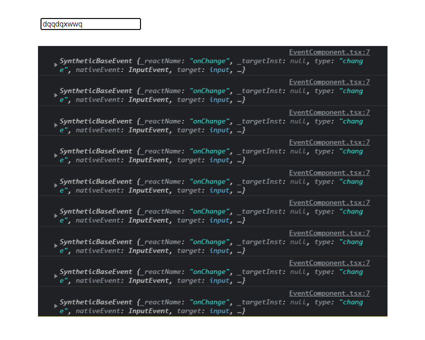
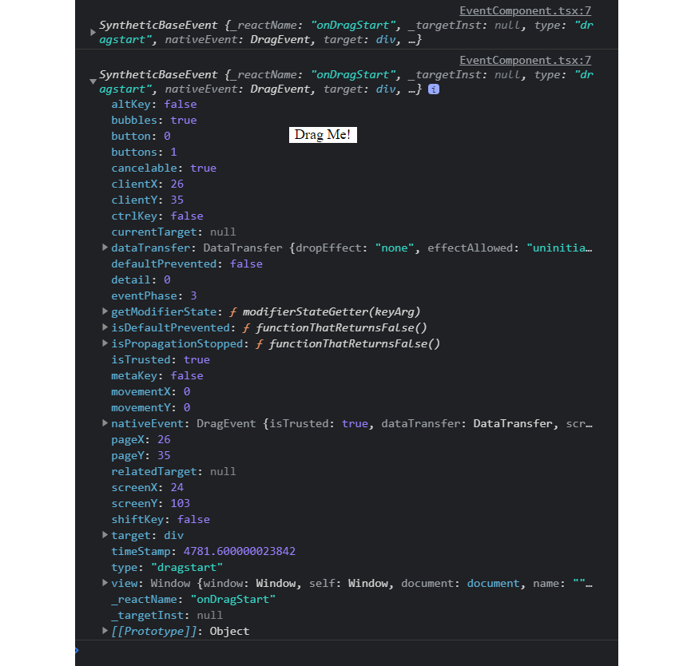

<div align="center" >
  <h1>Types handling Events</h1>

  
</div>

<br>
<br>

## Table of content

- [Table of content](#table-of-content)
- [Introduction: set a new EventComponent.tsx](#introduction-set-a-new-eventcomponenttsx)
- [Working on Events with ChangeEvent](#working-on-events-with-changeevent)
  - [Set The Callback inside the Component separately](#set-the-callback-inside-the-component-separately)
- [Handling Drag Event too](#handling-drag-event-too)

<br>
<br>
<br>
<br>
<br>

## Introduction: set a new EventComponent.tsx

Set a callback inline to the `onChange()` function

```typescript
const EventComponent: React.FC = () => {
  return (
    <div>
      <input onChange={ e => console.log(e) } />
    </div>
  )
}

export default EventComponent
```

A real quick `EventComponent` to demonstrate and manpulating React, typescript with events handlers.

<br>
<br>

<div align="center" >

  
</div>

<br>
<br>
<br>
<br>
<br>

## Working on Events with ChangeEvent

```typescript
const EventComponent: React.FC = () => {
  const onChange = e => console.log(e)

  return <div> <input onChange={ onChange } /> </div>
}

export default EventComponent
```

### Set The Callback inside the Component separately

***NOTICE: The Typescript types inference system is only applied into the JSX!!!***

Defining the `onChange() | ChangeEvent` function before the `JSX return() | <HTMLInputElement>`, will forcing us to specify types inference.

```typescript
const EventComponent: React.FC = () => {
  const onChange = (event: React.InputHTMLAttributes<HTMLInputElement>) => {
  console.log(event)
}

  return (
    <div>
      <input onChange={onChange} />
    </div>
  )
}

export default EventComponent
```

<br>
<br>

***TIP: to add the type and React.FC syntax on events:***

1. highlights the `onChange` JSX Attribute
2. Copy the `React.ChangeEvent<HTMLInputElement>` showed with vscode ts docs
3. and paste it on your arg: `event: React.ChangeEvent<HTMLInputElement>`

<br>
<br>
<br>
<br>
<br>

## Handling Drag Event too

***NOTES about events: mouse, keyboard, draggable, submit, click, hover, change...Use `CTRL  + click` on the `React.DragEvent<HTMLDivElement>` to access to the Typescript file about events***

*With Drag events, we need to specify the `draggable` attribute and the `onDragStart` event.*

```typescript
const EventComponent: React.FC = () => {
  const onDragStart = () => {console.log('I am being dragged!!')}

  return ( <div><div draggable onDragStart={onDragStart}>Drag Me!</div></div>
}

export default EventComponent
```

***NOTICE: just add the `event` object to the parameter and apply his type if you want to get data!!***

*Once again, we use the tip for adding the `event object type`...*

```typescript
const EventComponent: React.FC = () => {
  const onDragStart = (event: React.DragEvent<HTMLDivElement>) => {
    console.log(event)
  }

  return <div> <div draggable onDragStart={onDragStart}>Drag Me!</div> </div>
}

export default EventComponent
```

<br>
<br>

<div align="center" >

  
</div>

<br>
<br>