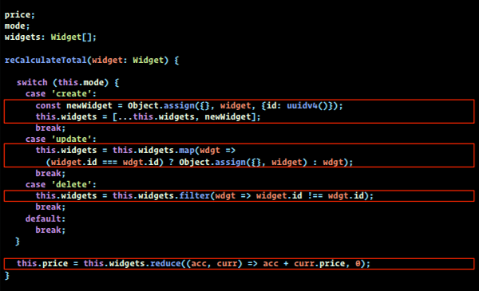
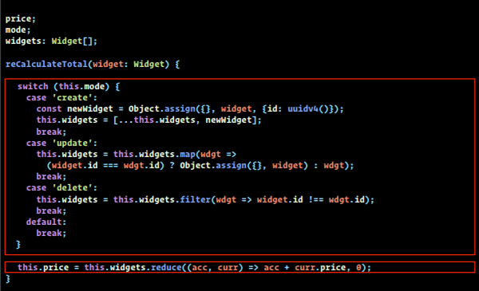
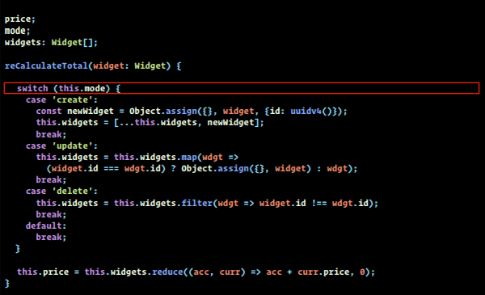

<div align="center" >
  <h1>Reducer Analysis</h1>
  <h3>About clean code...</h3>
  <br>
</div>


**Table of Content**

- [Introduction](#introduction)
- [Specific analysis](#specific-analysis)
  - [The Potentially **Nested Logic**](#the-potentially-nested-logic)
  - [**The SRP violation**](#the-srp-violation)
  - [The **Hidden State** case](#the-hidden-state-case)


## Introduction

Looking at **how simple could be our reducer**, the thought about **how the complexity will grow up as good as a project will be bigger**, and in terms of thinking the complexity of an application which could potentially scale for a large example software, we must think **how we could arrange, clean, organize our code files, folder and project in a better way**.


```typescript
/* our simple reducer already show us some points we can arrange or just think about if it would different... */
interface RepositoriesState {
    loading: boolean,
    error: string | null,
    data: string[]
}

const reducer = (state: RepositoriesState, action: any) => {
  switch (action.type) {
    /* extract constants can help so  */
    case 'search_repositories' :
      /* just thinking if the nested code would be more complex */
      return { loading: true, error: null, data: [] }
    case 'search_repositories_success':
      return { loading: false, error: null, data: action.payload }
    case 'search_repositories_error':
      return { loading: false, error: action.payload, data: [] }
    default:
      return state
  }
}

export default reducer
```

<br>
<br>
<br>

## Specific analysis

In our code example, this will not be the case because of the simple logic of the app we build. But in many cases, or situations, it can be tempting to centralize the entire reducer code in one unique file.

**This kind of thinking an application could be dramatic as a different way, it's really simple to code, attempting to avoid those potentially problems!** 

Even more the case on scalable applications...


### The Potentially **Nested Logic**

In a more advanced program, it will be great to think more about complexity! 
In our situation, building a reducer, maybe we will extract in a file, the  nested, embedded logic code in functions and imports them in the reducer file to avoid nested logic, potential conflict, to help testing...

<br>



<br>
<br>
<br>

### **The SRP violation**

Following the SOLID principles, we take a great advantage if we could avoid to violate the **"Single Responsability Principle"**... **One function can do "One Thing", One File can have One Responsability**. 
We attempt to purchase as much as we can simplicity & well organization...

<br>



<br>
<br>
<br>

### The **Hidden State** case

**A nested logic statement handling different states, different situations or even the use of some wrong methods** could break the program, make some strange behaviors or change a state... That's why we must pay attention to the bests practices...

Following the **FP paradigm, with the use of pure functions as `map(), filter(), reduce()`** must be taken and used seriously to help **with Typescript to avoid mutations of our data**.

<br>



<br>
<br>
<br>
