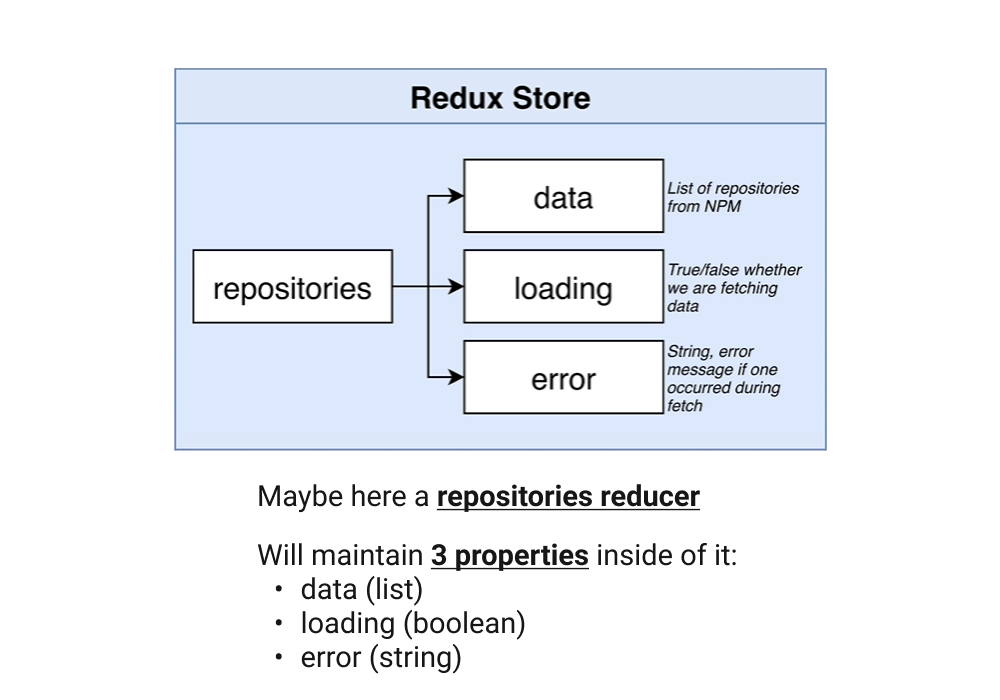
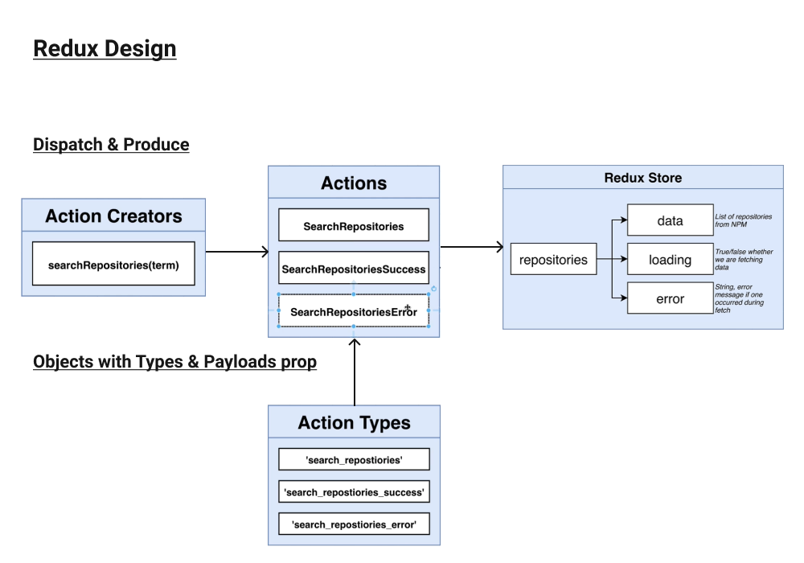

  <h1>Redux Design</h1>
  <h3>Demos illustrations of the redux side's project</h3>

 
 

Thinking about this simple project, it will need ***3 separates properties to a single repositories reducer**.

Our Store, as simple it is must be relevant, and in this case ***we will attempt to define our Actions in the best way we could using Typescript.***

 

 
 
 
 

***How integrating Typescript in our project can help us to improve our project organization?..***

