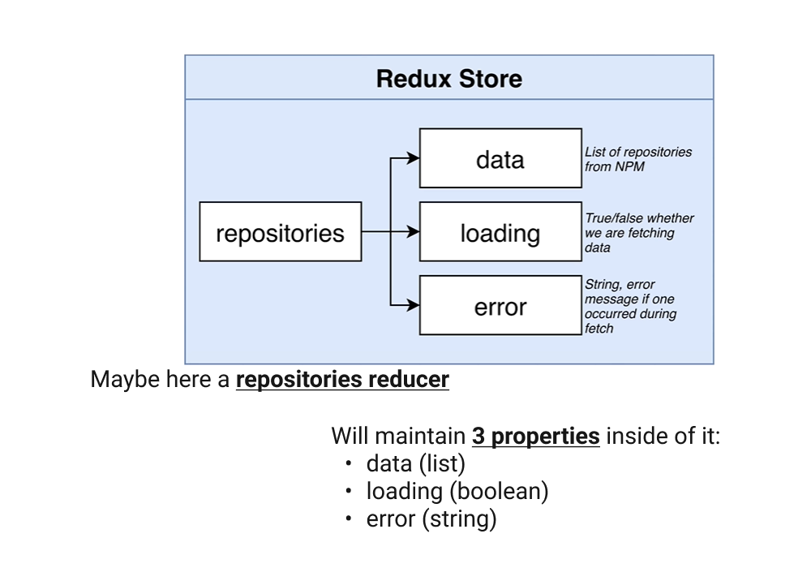
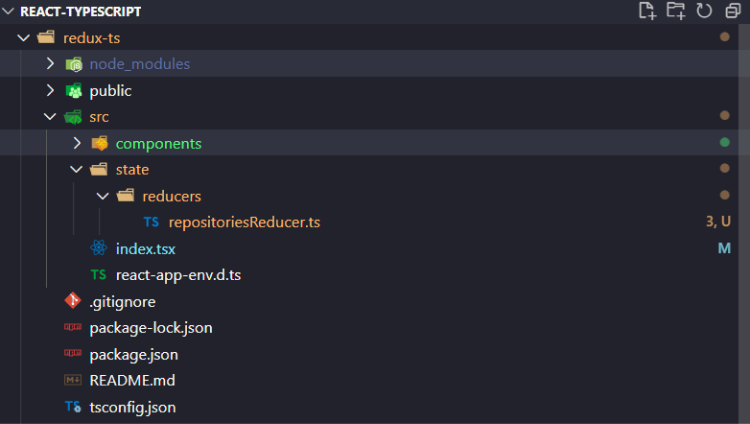

<div align="center" >
  <h1>Redux Store & Reducers</h1>
  <h3>About reducers...</h3>

  

  <br>

</div>

**Table of Content**

- [Reducer: creating & organizing](#reducer-creating--organizing)
  - [Files Architecture](#files-architecture)
  - [Reducer file](#reducer-file)
    - [1. The Basics](#1-the-basics)
    - [2.The Interface](#2the-interface)
    - [3. The Switch statements](#3-the-switch-statements)
    - [4. The Actions](#4-the-actions)
    - [**NOTE :** as Simple is this Reducer, Typescript must do more...](#note--as-simple-is-this-reducer-typescript-must-do-more)
    - [**NOTE :** extract & rename those actions types as Constants](#note--extract--rename-those-actions-types-as-constants)

<br>
<br>
<br>

## Reducer: creating & organizing

### Files Architecture



### Reducer file

#### 1. The Basics

```typescript
const reducer = (state, action) => {}

export default reducer
```

<br>
<br>

#### 2.The Interface

```typescript
interface RepositoriesState {
  loading: boolean,
    error: string | null,
    data: string[]
}

/* action are types as `any` waiting to define those actions */
const reducer = (state: RepositoriesState, action: any) => {}

export default reducer
```

#### 3. The Switch statements

```typescript
interface RepositoriesState {
  loading: boolean,
    error: string | null,
    data: string[]
}

/* action are types as `any` waiting to define those actions */
const reducer = (state: RepositoriesState, action: any) => {
  switch (action.type) {
    case 'search_repositories' :
      ...
    case 'search_repositories_success':
      ...
    case 'search_repositories_error':
      ...     
    default:
      return state
  }
}

export default reducer
```

<br>
<br

#### 4. The Actions


```typescript
interface RepositoriesState {
  loading: boolean,
    error: string | null,
    data: string[]
}

/* action are types as `any` waiting to define those actions */
const reducer = (state: RepositoriesState, action: any) => {
  switch (action.type) {
    case 'search_repositories' :
      return { loading: true, error: null, data: [] }
    case 'search_repositories_success':
      return { loading: false, error: null, data: action.payload }
    case 'search_repositories_error':
      return { loading: false, error: action.payload, data: [] }
    default:
      return state
  }
}

export default reducer
```

<br>
<br

#### **NOTE :** as Simple is this Reducer, Typescript must do more...

We just noticed that ***this Reducer model should work but Typescript must do more, especially on that switch statement distributing data.***

You can clearly think that data could be as many types projects are different. And Typescript will secure those types.

**Example of the data property :**
it could be an Array of course, an object too but even strings and numbers!!! So we must use Typescript on that purpose!!


<br>
<br


#### **NOTE :** extract & rename those actions types as Constants

To gain in terms of visibility and organization, we define our actions types as Constant written in uppercase...
Those constants should be extract in separate file to be consistent...

```typescript
interface RepositoriesState {
  loading: boolean,
    error: string | null,
    data: string[]
}
const SEARCH_REPOSITORIES = 'search_repositories'
const SEARCH_REPOSITORIES_SUCCESS = 'search_repositories_success'
const SEARCH_REPOSITORIES_ERROR = 'search_repositories_error'


/* action are types as `any` waiting to define those actions */
const reducer = (state: RepositoriesState, action: any) => {
  switch (action.type) {
    case 'SEARCH_REPOSITORIES' :
      ...
    case 'SEARCH_REPOSITORIES_SUCCESS':
      ...
    case 'SEARCH_REPOSITORIES_ERROR':
      ...          
    default:
      return state
  }
}

export default reducer
```

<br>
<br>
<br>
<br>
<br>

