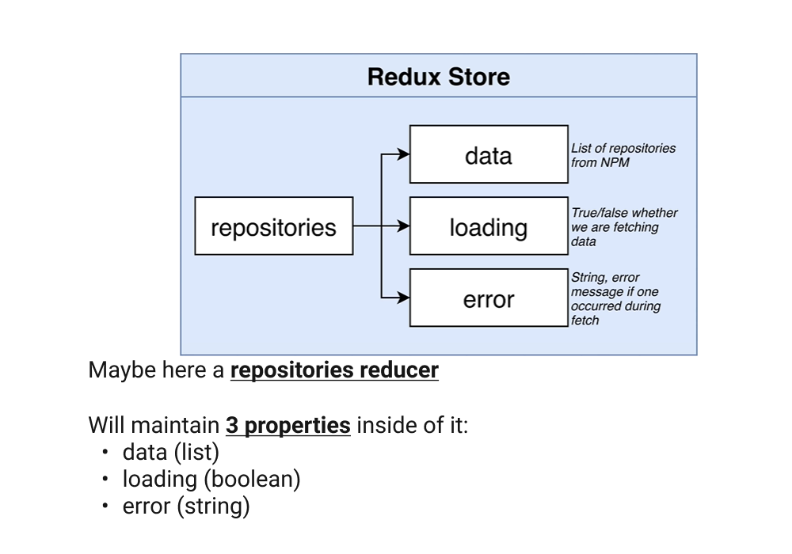
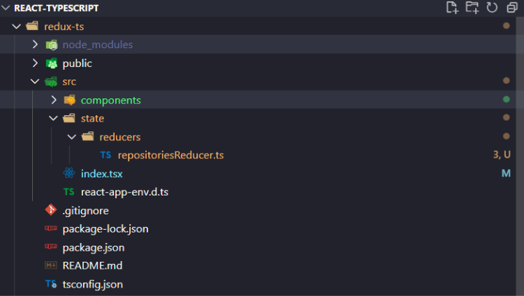
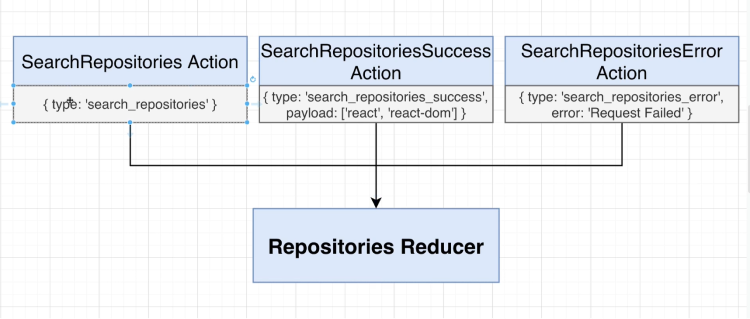

<div align="center" >
  <h1>Redux Store & Reducers</h1>
  <h3>About reducers...</h3>

  

  <br>

</div>

**Table of Content**

- [Reducer: creating & organizing](#reducer-creating--organizing)
  - [Files Architecture](#files-architecture)
  - [Reducer file (repositoriesReducer.ts)](#reducer-file-repositoriesreducerts)
    - [1. The Basics](#1-the-basics)
    - [2. The Interface](#2-the-interface)
    - [3. The Switch statements](#3-the-switch-statements)
    - [4. The Actions](#4-the-actions)
      - [**NOTE :** as simple is this Reducer, Typescript must do more...](#note--as-simple-is-this-reducer-typescript-must-do-more)
    - [5. Typechecking with TS](#5-typechecking-with-ts)
      - [**Defining the return values** `: RepositoriesState` of the reducer](#defining-the-return-values--repositoriesstate-of-the-reducer)
      - [**Defining the Action types**](#defining-the-action-types)
      - [**NOTE :** about avoiding the `any` TS type](#note--about-avoiding-the-any-ts-type)

<br>
<br>
<br>

## Reducer: creating & organizing

### Files Architecture



### Reducer file (repositoriesReducer.ts)

#### 1. The Basics

```typescript
const reducer = (state, action) => {}

export default reducer
```

<br>
<br>

#### 2. The Interface

```typescript
interface RepositoriesState {
  loading: boolean,
    error: string | null,
    data: string[]
}

/* action are types as `any` waiting to define those actions */
const reducer = (state: RepositoriesState, action: any) => {}

export default reducer
```

<br>
<br>

#### 3. The Switch statements

```typescript
interface RepositoriesState {
  loading: boolean,
    error: string | null,
    data: string[]
}

/* action are types as `any` waiting to define those actions */
const reducer = (state: RepositoriesState, action: any) => {
  switch (action.type) {
    case 'search_repositories' :
      ...
    case 'search_repositories_success':
      ...
    case 'search_repositories_error':
      ...     
    default:
      return state
  }
}

export default reducer
```

<br>
<br>

#### 4. The Actions

*Adding the return values `{ loading: true, error: null, data: [] }` expected for each actions...*

```typescript
interface RepositoriesState {
  loading: boolean,
    error: string | null,
    data: string[]
}

/* action are types as `any` waiting to define those actions */
const reducer = (state: RepositoriesState, action: any) => {
  switch (action.type) {
    case 'search_repositories' :
      return { loading: true, error: null, data: [] }
    case 'search_repositories_success':
      return { loading: false, error: null, data: action.payload }
    case 'search_repositories_error':
      return { loading: false, error: action.payload, data: [] }
    default:
      return state
  }
}

export default reducer
```

<br>
<br>

##### **NOTE :** as simple is this Reducer, Typescript must do more...

We just noticed that ***this Reducer model should work but Typescript must do more, especially on that switch statement distributing data.***

You can clearly think that data could be as many types projects are different. And Typescript will secure those types.

**Example of the data property :**
it could be an Array of course, an object too but even strings and numbers!!! So we must use Typescript on that purpose!!


<br>
<br

#### 5. Typechecking with TS

##### **Defining the return values** `: RepositoriesState` of the reducer

We ensure Typescript is checking for us **what types of values we need for each properties `{ loading: true, error: null, data: [] }`. Otherwise TS will show an error...**

<br>
<br>

```typescript
const reducer = (state: RepositoriesState, action: any): RepositoriesState => {
  switch (action.type) { ... }
}
```

```typescript
interface RepositoriesState {
  loading: boolean,
    error: string | null,
    data: string[]
}

/* we define the type expected on the reducer output */
const reducer = (state: RepositoriesState, action: any): RepositoriesState => {
  switch (action.type) {
    case 'search_repositories' :
      return { loading: true, error: null, data: [] }
    case 'search_repositories_success':
      return { loading: false, error: null, data: action.payload }
    case 'search_repositories_error':
      return { loading: false, error: action.payload, data: [] }
    default:
      return state
  }
}

export default reducer
```

##### **Defining the Action types** 

By **adding an `interface`** and **replace it in the reducer function `action: Action`**

```typescript
interface Action {
  type: string,
  payload ?: any
}
```

```typescript
const reducer = (state: RepositoriesState, action: Action): RepositoriesState => {
  ...
}
```

<br>
<br>

##### **NOTE :** about avoiding the `any` TS type

*Here a schema of why we potentially need to differentiate those Actions types...*


<br>
<br>

*To avoid the `any` type of Typescript, we code 3 different `interface` to have 3 separates Actions Interfaces.*



<br>
<br>

1. **Defining interfaces**

*Here the code example in our app.*

```typescript
interface SearchRepositoriesAction  {
  type: 'search_repositories'
}

interface SearchRepositoriesSuccessAction {
  type: 'search_repositories_success'
 payload: string[] 
}

interface SearchRepositoriesErrorAction {
  type: 'search_repositories_error'
  payload: string   
} 
```

*Applying those Actions interfaces:*

```typescript

const reducer = (
  state: RepositoriesState,
  action:
    | SearchRepositoriesAction
    | SearchRepositoriesSuccessAction
    | SearchRepositoriesErrorAction
): RepositoriesState => { ... }
```

***The typescript `interface` keyword is way have more control on our types, there are "Types Guards"***

<br>
<br>

2. **Grouping those interfaces in One `type`**

```typescript
/* grouping all actions in one type called "Action" */
type Action =
    | SearchRepositoriesAction
    | SearchRepositoriesSuccessAction
    | SearchRepositoriesErrorAction
  
const reducer = (
  state: RepositoriesState,
  action: Action
): RepositoriesState => {
  switch (action.type) { ... }
}
```

3. **Set an `enum` action type object**

To approve ***code readability and following the convention, we replace the `'search_repositories_success'` by `SEARCH_REPOSITORIES_SUCCESS` all capitalized using the `enum` typescript keyword*** which set those string to an `ActionType` object.

- **define `enum ActionType {}`**

```typescript
enum ActionType  {
  SEARCH_REPOSITORIES = 'search_repositories',
  SEARCH_REPOSITORIES_SUCCESS = 'search_repositories_success',
  SEARCH_REPOSITORIES_ERROR = 'search_repositories_error'
}
```

- **Accessing those**

to access: `ActionType.SEARCH_REPOSITORIES`
in our case: `case ActionType.SEARCH_REPOSITORIES :`

- **Replacing in all file**

```typescript
const reducer = (
  state: RepositoriesState,
  action: Action
): RepositoriesState => {
  switch (action.type) {
    case ActionType.SEARCH_REPOSITORIES :
      return { loading: true, error: null, data: [] }
    case ActionType.SEARCH_REPOSITORIES_SUCCESS :
      return { loading: false, error: null, data: action.payload }
    case ActionType.SEARCH_REPOSITORIES_ERROR :
      return { loading: false, error: action.payload, data: [] }
    default:
      return state
  }
}
```

```typescript
interface SearchRepositoriesAction  {
  type: ActionType.SEARCH_REPOSITORIES
}
```

4. **Extract those settings to a File**

