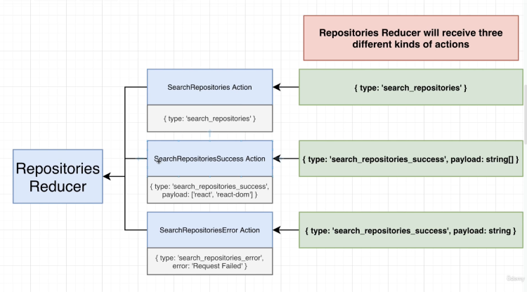

<style>
bgc { background-color: #21222C; color: #f1f1f1; padding: 5px; border-radius: 2px; }
anc { color: rebeccapurple; font-weight: bold; }
anc2 { background-color: rebeccapurple; color: #fff; padding: 5px; px; border-radius: 2px; }
high { background-color: yellow; font-style: italic; padding: 2px; color: #000; }
b { font-weight: bold; color: #000; }
</style>

<div align="center" >
  <h1>Redux Store & Reducers</h1>
  <h3>About reducers...</h3>

  

  <br>

</div>

**<bgc>Table of Content</bgc>**

- [<anc>Reducer: creating & organizing</anc>](#ancreducer-creating--organizinganc)
  - [<anc>Files Architecture</anc>](#ancfiles-architectureanc)
  - [<anc>Reducer file (repositoriesReducer.ts)</anc>](#ancreducer-file-repositoriesreducertsanc)
    - [<anc>1. The Basics</anc>](#anc1-the-basicsanc)
    - [<anc>2. The Interface</anc>](#anc2-the-interfaceanc)
    - [<anc>3. The Switch statements</anc>](#anc3-the-switch-statementsanc)
    - [<anc>4. The Actions</anc>](#anc4-the-actionsanc)
      - [<high>NOTE :</high> <b>as simple is this Reducer, Typescript must do more...</b>](#highnote-high-bas-simple-is-this-reducer-typescript-must-do-moreb)
  - [<anc>Typechecking with TS</anc>](#anctypechecking-with-tsanc)
    - [<anc>Defining the return values `: RepositoriesState` of the reducer</anc>](#ancdefining-the-return-values--repositoriesstate-of-the-reduceranc)
    - [<anc>Defining the Action types</anc>](#ancdefining-the-action-typesanc)
    - [<high>NOTE :</high> <b>about avoiding the `any` TS type</b>](#highnote-high-babout-avoiding-the-any-ts-typeb)
  - [<anc>Organizing Files Architecture</anc>](#ancorganizing-files-architectureanc)
    - [<anc>Files Architecture review</anc>](#ancfiles-architecture-reviewanc)
    - [<anc>Files Architecture Pattern growing up</anc>](#ancfiles-architecture-pattern-growing-upanc)

<br>
<br>
<br>

## <anc>Reducer: creating & organizing</anc>

### <anc>Files Architecture</anc>


### <anc>Reducer file (repositoriesReducer.ts)</anc>

#### <anc>1. The Basics</anc>

```typescript
const reducer = (state, action) => {}

export default reducer
```

<br>
<br>

#### <anc>2. The Interface</anc>

```typescript
interface RepositoriesState {
  loading: boolean,
    error: string | null,
    data: string[]
}

/* action are types as `any` waiting to define those actions */
const reducer = (state: RepositoriesState, action: any) => {}

export default reducer
```

<br>
<br>

#### <anc>3. The Switch statements</anc>

```typescript
interface RepositoriesState {
  loading: boolean,
    error: string | null,
    data: string[]
}

/* action are types as `any` waiting to define those actions */
const reducer = (state: RepositoriesState, action: any) => {
  switch (action.type) {
    case 'search_repositories' :
      ...
    case 'search_repositories_success':
      ...
    case 'search_repositories_error':
      ...     
    default:
      return state
  }
}

export default reducer
```

<br>
<br>

#### <anc>4. The Actions</anc>

*Adding the return values `{ loading: true, error: null, data: [] }` expected for each actions...*

```typescript
interface RepositoriesState {
  loading: boolean,
    error: string | null,
    data: string[]
}

/* action are types as `any` waiting to define those actions */
const reducer = (state: RepositoriesState, action: any) => {
  switch (action.type) {
    case 'search_repositories' :
      return { loading: true, error: null, data: [] }
    case 'search_repositories_success':
      return { loading: false, error: null, data: action.payload }
    case 'search_repositories_error':
      return { loading: false, error: action.payload, data: [] }
    default:
      return state
  }
}

export default reducer
```

<br>
<br>

---

##### <high>NOTE :</high> <b>as simple is this Reducer, Typescript must do more...</b>

We just noticed that ***this Reducer model should work but Typescript must do more, especially on that switch statement distributing data.***

You can clearly think that data could be as many types projects are different. And Typescript must secure those types.

**Example of the data property :**
it could be an Array of course, an object too but even strings and numbers!!! So we must use Typescript on that purpose!!

---

<br>
<br

### <anc>Typechecking with TS</anc>

#### <anc>Defining the return values `: RepositoriesState` of the reducer</anc>

We ensure Typescript is checking for us **what types of values we need for each properties `{ loading: true, error: null, data: [] }`. Otherwise TS will show an error...**

<br>
<br>

```typescript
const reducer = (state: RepositoriesState, action: any): RepositoriesState => {
  switch (action.type) { ... }
}
```

```typescript
interface RepositoriesState {
  loading: boolean,
    error: string | null,
    data: string[]
}

/* we define the type expected on the reducer output */
const reducer = (state: RepositoriesState, action: any): RepositoriesState => {
  switch (action.type) {
    case 'search_repositories' :
      return { loading: true, error: null, data: [] }
    case 'search_repositories_success':
      return { loading: false, error: null, data: action.payload }
    case 'search_repositories_error':
      return { loading: false, error: action.payload, data: [] }
    default:
      return state
  }
}

export default reducer
```

#### <anc>Defining the Action types</anc>

By **adding an `interface`** and **replace it in the reducer function `action: Action`**

```typescript
interface Action {
  type: string,
  payload ?: any
}
```

```typescript
const reducer = (state: RepositoriesState, action: Action): RepositoriesState => {
  ...
}
```

<br>
<br>

---

#### <high>NOTE :</high> <b>about avoiding the `any` TS type</b>

*Here a schema of why we potentially need to differentiate those Actions types...*



<br>
<br>

*To avoid the `any` type of Typescript, we code 3 different `interface` to have 3 separates Actions Interfaces.*


<br>
<br>

<anc>1. Defining interfaces</anc>

*Here the code example in our app.*

```typescript
interface SearchRepositoriesAction  {
  type: 'search_repositories'
}

interface SearchRepositoriesSuccessAction {
  type: 'search_repositories_success'
 payload: string[] 
}

interface SearchRepositoriesErrorAction {
  type: 'search_repositories_error'
  payload: string   
} 
```

*Applying those Actions interfaces:*

```typescript

const reducer = (
  state: RepositoriesState,
  action:
    | SearchRepositoriesAction
    | SearchRepositoriesSuccessAction
    | SearchRepositoriesErrorAction
): RepositoriesState => { ... }
```

***The typescript `interface` keyword is way have more control on our types, there are "Types Guards"***

<br>
<br>

<anc>2. Grouping those interfaces in One `type`</anc>

```typescript
/* grouping all actions in one type called "Action" */
type Action =
    | SearchRepositoriesAction
    | SearchRepositoriesSuccessAction
    | SearchRepositoriesErrorAction
  
const reducer = (
  state: RepositoriesState,
  action: Action
): RepositoriesState => {
  switch (action.type) { ... }
}
```

<anc>3. Set an `enum` action type object</anc>

To approve ***code readability and following the convention, we replace the `'search_repositories_success'` by `SEARCH_REPOSITORIES_SUCCESS` all capitalized using the `enum` typescript keyword*** which set those string to an `ActionType` object.

- <anc2>define `enum ActionType {}`</anc2>

```typescript
enum ActionType  {
  SEARCH_REPOSITORIES = 'search_repositories',
  SEARCH_REPOSITORIES_SUCCESS = 'search_repositories_success',
  SEARCH_REPOSITORIES_ERROR = 'search_repositories_error'
}
```

- <anc2>Accessing those</anc2>

to access: `ActionType.SEARCH_REPOSITORIES`
in our case: `case ActionType.SEARCH_REPOSITORIES :`

- <anc2>Replacing in all file</anc2>

```typescript
const reducer = (
  state: RepositoriesState,
  action: Action
): RepositoriesState => {
  switch (action.type) {
    case ActionType.SEARCH_REPOSITORIES :
      return { loading: true, error: null, data: [] }
    case ActionType.SEARCH_REPOSITORIES_SUCCESS :
      return { loading: false, error: null, data: action.payload }
    case ActionType.SEARCH_REPOSITORIES_ERROR :
      return { loading: false, error: action.payload, data: [] }
    default:
      return state
  }
}
```

```typescript
interface SearchRepositoriesAction  {
  type: ActionType.SEARCH_REPOSITORIES
}
```

4. <anc>Extract those settings to a File</anc>

On that purpose, processing the code control of our projects, we must extract some works we do to improve even more our code base.

 1. We defined `interface`, grouped in one unique object type called `Action` to set the `reducer.action` property
 2. We defined an `enum ActionType` and replaced those on the `interface` and `reducer.action`
 3. Finally we'll extract in modifying our files architecture

---

<br>
<br>
<br>
<br>

### <anc>Organizing Files Architecture</anc>

#### <anc>Files Architecture review</anc>


- Create 2 folders `actions` and `action-types`
- Create an `index.ts` file for each one
- Extract actions to the `actions` folder:

```typescript
/*  adding the `export` keyword  */
interface SearchRepositoriesAction  {
  type: ActionType.SEARCH_REPOSITORIES
}

interface SearchRepositoriesSuccessAction {
  type: ActionType.SEARCH_REPOSITORIES_SUCCESS
 payload: string[] 
}

interface SearchRepositoriesErrorAction {
  type: ActionType.SEARCH_REPOSITORIES_ERROR
  payload: string   
}

export type Action =
    | SearchRepositoriesAction
    | SearchRepositoriesSuccessAction
    | SearchRepositoriesErrorAction
```

- Extract `enum ActionType` to the `action-types` folder:

```typescript
/*  adding the `export` keyword  */
export enum ActionType {
  SEARCH_REPOSITORIES = 'search_repositories',
  SEARCH_REPOSITORIES_SUCCESS = 'search_repositories_success',
  SEARCH_REPOSITORIES_ERROR = 'search_repositories_error'
}
```

- Use the `import` / `export` syntax to have access...

#### <anc>Files Architecture Pattern growing up</anc>

We can now easily visualize our code base as well organized, adding features on each sections of our project.

1. We have our `state/` main folder for the "redux side project"
2. The `reducers/` will contains all reducers we need
3. And a `action-types/` folder to store all of our `enum` ActionTypes.
4. finally we can grow up this kind of well architecture by adding some folders for each action types `interface`


